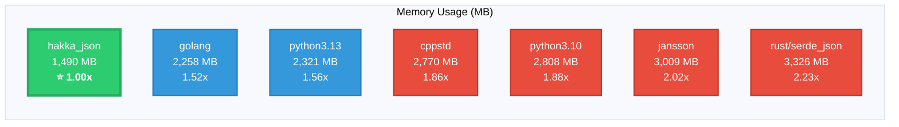

# Hakka JSON 🚀

**Blazingly small, memory-efficient JSON library for C++** ⚡

Modern C++ JSON library designed for **extreme memory efficiency**. Built with C++23, provides both C++ and C APIs.

## ✨ Features

- **💾 Memory Champion**: Minimal runtime footprint with string deduplication
- **📚 Read-Heavy Optimized**: Load once, read many times (R ≫ W)
- **🌍 Unicode Ready**: Full ICU integration
- **🔧 Dual APIs**: Modern C++ API + clean C API with C99 compatibility
- **🧪 Battle Tested**: Comprehensive test suite

## 🎯 When to Use

**Perfect when memory is your bottleneck!** 🌟

- Read-heavy workloads with repeated string values
- Memory-critical environments (embedded, mobile, IoT, large json data)
- Frequent small appends to JSON structures

[📖 **Full Documentation**](https://cycraft-corp.github.io/hakka_json/) | [🚀 **Getting Started**](https://cycraft-corp.github.io/hakka_json/)

## ⚡ Benchmark

### Memory Usage Comparison

**Test**: 481 MB [ClickHouse dataset from jsonbench.com](https://jsonbench.com/)

| Library | Memory (MB) | Relative | File Size Multiplier |
|---------|-------------|----------|----------------------|
| **hakka_json** 🏆 | 1,490 | **1.00x** | **3.1x** |
| golang | 2,258 | 1.52x | 4.7x |
| python3.13 | 2,321 | 1.56x | 4.8x |
| cppstd | 2,770 | 1.86x | 5.8x |
| python3.10 | 2,808 | 1.88x | 5.8x |
| jansson | 3,009 | 2.02x | 6.3x |
| rust/serde_json | 3,326 | 2.23x | 6.9x |

**🎯 Key Results:**
- **33% less memory** than golang (2nd place)
- **55% less memory** than rust/serde_json (last place)
- **Only 3.1x file size** - competitors need 4.7x to 6.9x

**📊 Full benchmark details**: [tests/benchmark/README.md](tests/benchmark/README.md)

## 🔨 Compiler Support

| Platform | Compiler | Versions | Status |
|----------|----------|----------|--------|
| **Linux** | GCC | 11, 12, 13, 14, 15, 16 |  |
| **Linux** | Clang/LLVM | 17, 18, 19, 20, 21, 22 |  |
| **macOS** | Apple Clang | Xcode 15.2, 15.4 |  |
| **Windows** | MSVC | VS 2022 |  |

**Sanitizers Tested**: Address, Undefined Behavior, Thread, Memory (Clang) | **Build Types**: Debug, Release

## 🤝 Contributing

Contributions welcome! See [CONTRIBUTING.md](CONTRIBUTING.md).

## 📄 License

Dual-licensed: [Boost Software License 1.0](LICENSE-BOOST) OR [BSD 3-Clause](LICENSE-BSD). See [LICENSE](LICENSE).

---
*Made with ❤️ by scc@cycraft*
