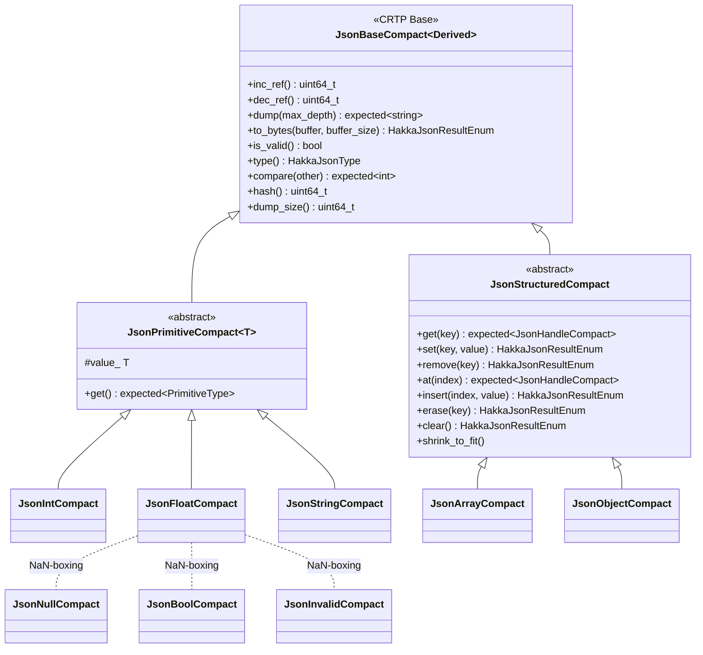
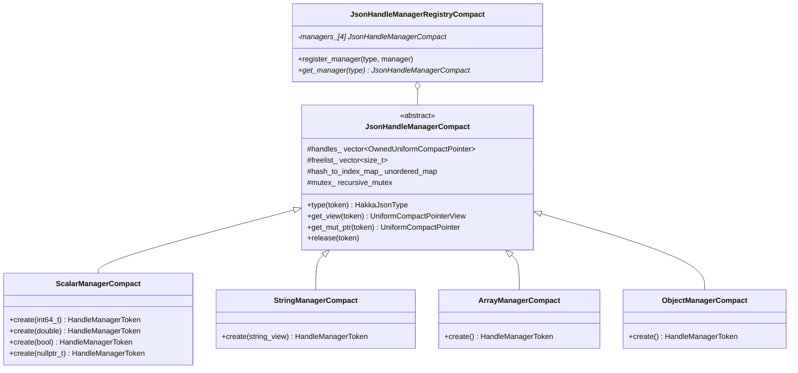
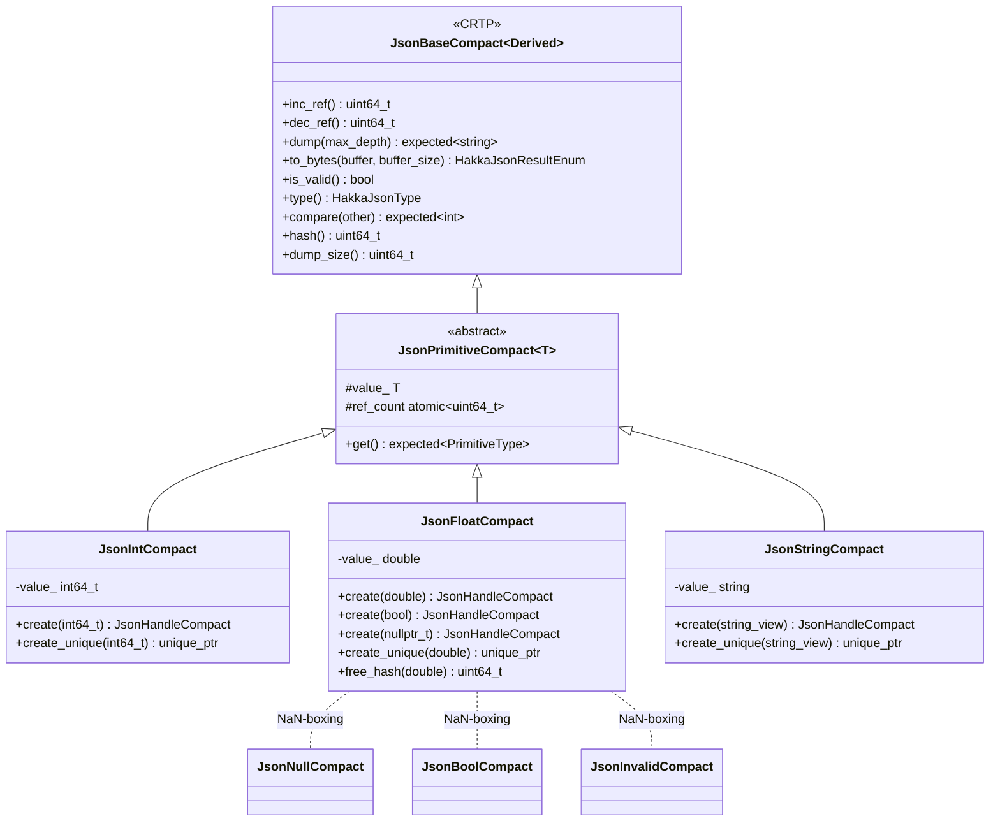
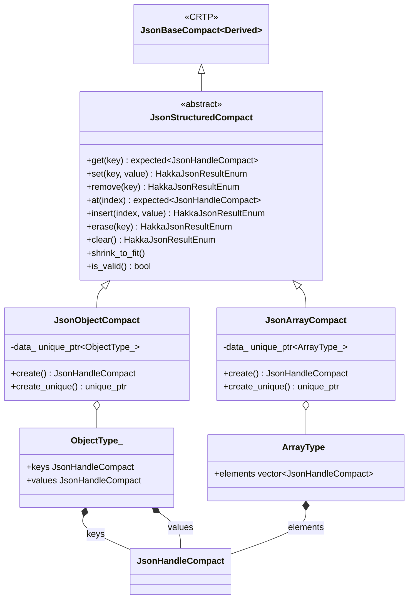

## Overview

The Hakka JSON library implements an extremely memory-efficient JSON data type system specifically designed to minimize runtime memory consumption. Through aggressive optimization techniques including NaN-boxing, automatic value deduplication, compact handle tokens, and CRTP (Curiously Recurring Template Pattern), the library achieves minimal memory overhead while maintaining full JSON functionality. All JSON data types inherit from the `JsonBaseCompact<Derived>` template class, which eliminates vtable pointers and enables compile-time polymorphism for zero abstraction cost.

# Memory Efficiency Benchmark

!!! success "TL;DR"
    **Hakka JSON** uses the least memory in our test cohort: **6.0 MB (1.00× baseline)**.  
    Typical competitors range from **~2.0×** to **~3.3×** overhead.

!!! warning "Data confidentiality"
    Benchmark inputs are **non-open source** and cannot be redistributed. Results are reported from an internal JSON document with similar public methodology provided below.

=== "Summary"
    Below is the headline table. Jump to **Methodology** for how we measured and **Reproducibility** to run a comparable test with your own data.

    | Implementation | Memory Usage (MB) | Memory Overhead Rate |
    |----------------|-------------------:|---------------------:|
    | **Hakka JSON** | **6.0**           | **1.00×** *(baseline)* |
    | C++ std        | 11.9              | 1.98× |
    | C++ nlohmann   | 12.1              | 2.02× |
    | Python 3.12    | 14.1              | 2.35× |
    | Rust           | 15.7              | 2.62× |
    | Python 3.10    | 16.3              | 2.72× |
    | C Jansson      | 20.0              | 3.33× |

=== "Methodology"
    ??? note "What we measured"
        - **Metric:** Peak resident set size (RSS) while parsing a JSON document and holding the in-memory representation.
        - **Baseline:** Hakka JSON = **6.0 MB** → **1.00×**.
        - **Workload:** Identical document shape across implementations.
        - **Builds:** Release / optimized; no sanitizers or debug allocators.
        - **Env:** Same host, same OS image; see “Environment” below.

    ??? tip "Why overhead rate?"
        Raw MB can vary by allocator/kernel. The **overhead factor** normalizes results against the baseline, so trends are stable across machines.

    ??? info "Environment (example)"
        - OS: Arch Linux (x86_64), kernel 6.16.8-arch3-1  
        - CPU: Intel® Core™ i5-13500  
        - RAM: 32 GB  
        - libc: glibc 2.42  
        - GCC: 15.2.1 (release, `-O3 -DNDEBUG`)

---

## Notes

- Values above are rounded for readability; the CSV contains exact medians.  
- Memory usage can vary by allocator and kernel; overhead **ratios** tend to be stable across environments.



## Handle-Based Memory Management

The library employs a sophisticated handle-based memory management system specifically engineered to minimize memory footprint. Through 32-bit compact handle tokens (instead of 64-bit pointers), automatic value deduplication, and efficient freelist-based allocation, the system achieves exceptional memory density while providing thread-safe operations.

### JsonHandleCompact

The `JsonHandleCompact` class is a smart pointer-like wrapper that manages JSON objects through a handle token system. It provides automatic reference counting and seamless interaction with the underlying JSON data types.

**Key Features:**

- **Compact representation**: 32-bit handle token (50% smaller than 64-bit pointers)
- **Reference counting for CPython integration**: Designed to align with Python's object lifetime management mechanism (see [Design Rationale](#reference-counting-for-cpython-integration))
- **Type-safe access**: Zero-cost abstractions for accessing underlying JSON objects
- **Thread-safe operations**: Centralized synchronization through manager coordination
- **Zero-copy semantics**: Efficient copy and move operations

### Handle Manager System

The handle management system consists of specialized manager classes that control the lifecycle of JSON objects:



### HandleManagerToken

A `HandleManagerToken` is a 32-bit encoded value that uniquely identifies a JSON object and its type.

**Binary Layout:**
```
| 31 ... 30 | 29 ... 0 |
|   Type    |  Index   |
```

## Type Encoding

- `00` (bits 31–30): Scalar types (int, float, bool, null, invalid)

    - `001` (bits 31–29): Integer
    - `000` (bits 31–29): Float/Bool/Null/Invalid

- `01` (bits 31–30): String
- `10` (bits 31–30): Array
- `11` (bits 31–30): Object

## Examples

- `0x20000001`: Integer at index 1 (binary: `00100000 00000000 00000000 00000001`)
- `0x40000000`: String at index 0 (binary: `01000000 00000000 00000000 00000000`)
- `0x80000005`: Array at index 5 (binary: `10000000 00000000 00000000 00000101`)
- `0xC0000010`: Object at index 16 (binary: `11000000 00000000 00000000 00010000`)

### Memory Management Algorithm

The handle manager system employs sophisticated algorithms specifically designed to minimize memory waste through aggressive reuse and compaction:

**Data Structures:**

- `handles_`: Compact vector storing active JSON object pointers
- `freelist_`: Min-heap of free indices for immediate reuse (minimizes memory fragmentation)
- `hash_to_index_map_`: Hash-based deduplication for immutable types (eliminates duplicate storage)

**Allocation Strategy (Memory-First Approach):**

1. **Deduplication check**: Search `hash_to_index_map_` for existing identical object (scalars and strings only)
2. **Reuse existing**: If found, increment reference count and return existing token (zero allocation)
3. **Reclaim freed slots**: Pop smallest index from `freelist_` to fill gaps (prevents memory fragmentation)
4. **Grow only when necessary**: If freelist empty, append to `handles_` vector
5. **Track for deduplication**: Update hash map for immutable types

**Deallocation Strategy (Aggressive Compaction):**

1. **Reference counting**: Decrement reference count atomically
2. **Immediate reclaim**: If count reaches zero, mark index as free in `freelist_`
3. **Nullify slot**: Set `handles_[index]` to nullptr (releases object memory)
4. **Automatic compaction**: Apply shrink-to-fit heuristic to reclaim trailing memory

**Shrink-to-Fit Heuristic (Memory Density Optimization):**

- **Skip unnecessary work**: If `freelist.size() > handles.size() / 2`, defer compaction (avoids expensive operations)
- **Aggressive tail trimming**: Remove all trailing nullptr entries to minimize vector capacity
- **Freelist cleanup**: Remove indices beyond new vector size and rebuild heap
- **Capacity reduction**: Call `shrink_to_fit()` on both vectors to release OS memory

**Example State Transitions:**
```
Initial: handles_: [Obj0 | Obj1 | Obj2 | Obj3 | Obj4]
         freelist_: []

After releasing Obj1 and Obj3:
         handles_: [Obj0 | nullptr | Obj2 | nullptr | Obj4]
         freelist_: [1, 3]  (min-heap)

Adding new Obj5:
         handles_: [Obj0 | Obj5 | Obj2 | nullptr | Obj4]
         freelist_: [3]  (index 1 reused)

After shrink-to-fit (all trailing nullptrs removed):
         handles_: [Obj0 | Obj5 | Obj2]
         freelist_: []
```

## Enum Types

### HakkaJsonResultEnum

Represents the result status of JSON operations.

```cpp
enum HakkaJsonResultEnum {
    HAKKA_JSON_SUCCESS,                    // Operation completed successfully
    HAKKA_JSON_PARSE_ERROR,                // JSON parsing failed
    HAKKA_JSON_TYPE_ERROR,                 // Type mismatch error
    HAKKA_JSON_NOT_ENOUGH_MEMORY,          // Insufficient memory
    HAKKA_JSON_KEY_NOT_FOUND,              // Object key not found
    HAKKA_JSON_INDEX_OUT_OF_BOUNDS,        // Array index out of range
    HAKKA_JSON_INVALID_ARGUMENT,           // Invalid argument provided
    HAKKA_JSON_OVERFLOW,                   // Numeric overflow
    HAKKA_JSON_RECURSION_DEPTH_EXCEEDED,   // Maximum recursion depth exceeded
    HAKKA_JSON_ITERATOR_END,               // Iterator reached end
    HAKKA_JSON_INTERNAL_ERROR              // Internal library error
};
```

### HakkaJsonType

Represents the JSON data type classification.

```cpp
enum HakkaJsonType {
    HAKKA_JSON_NULL,       // JSON null value
    HAKKA_JSON_STRING,     // JSON string
    HAKKA_JSON_INT,        // JSON integer (64-bit signed)
    HAKKA_JSON_FLOAT,      // JSON floating-point number (IEEE 754 double)
    HAKKA_JSON_BOOL,       // JSON boolean
    HAKKA_JSON_OBJECT,     // JSON object (key-value map)
    HAKKA_JSON_ARRAY,      // JSON array (ordered list)
    HAKKA_JSON_INVALID     // Invalid/uninitialized value
};
```

## Primitive Types

Primitive types represent immutable JSON scalar values. All primitive types inherit from `JsonPrimitiveCompact<T>` and implement value semantics.



### JsonIntCompact

Represents a 64-bit signed integer value.

**Key Methods:**

- `static JsonHandleCompact create(int64_t value)`: Create integer handle (with deduplication)
- `tl::expected<PrimitiveType, HakkaJsonResultEnum> get()`: Retrieve integer value
- `tl::expected<std::string, HakkaJsonResultEnum> dump(uint32_t max_depth)`: Convert to string
- `HakkaJsonType type()`: Returns `HAKKA_JSON_INT`

**Memory Optimization Details:**

- **Automatic deduplication**: Identical integer values share single storage instance
- **Hash-based lookup**: O(1) check for existing values before allocation
- **Atomic reference counting**: Lock-free memory reclamation
- **Zero-copy sharing**: Multiple handles reference same underlying value

### JsonFloatCompact

Represents a 64-bit IEEE 754 floating-point value with NaN-boxing support.

**Key Methods:**

- `static JsonHandleCompact create(double value)`: Create float handle
- `static JsonHandleCompact create(bool value)`: Create bool handle (NaN-boxed)
- `static JsonHandleCompact create(std::nullptr_t)`: Create null handle (NaN-boxed)
- `tl::expected<PrimitiveType, HakkaJsonResultEnum> get()`: Retrieve value
- `HakkaJsonType type()`: Returns actual type (FLOAT, BOOL, NULL, or INVALID)

**NaN-Boxing Implementation:**

NaN-boxing is a technique that stores multiple types within a single double-precision floating-point value by exploiting the IEEE 754 NaN representation space.

**IEEE 754 Double Format:**
```
| Sign (1) | Exponent (11) | Mantissa (52) |
|    63    |   62 ... 52   |  51 ...  0    |
```

**NaN Range:**

- All exponent bits set (0x7FF): `0x7FF0000000000000` to `0x7FFFFFFFFFFFFFFF`
- Quiet NaN base: `0xFFF8000000000000`

**Encoded Values:**
```cpp
constinit static double NULL_NAN    = get_nan(0);  // 0xFFF8000000000000
constinit static double TRUE_NAN    = get_nan(1);  // 0xFFF8000000000001
constinit static double FALSE_NAN   = get_nan(2);  // 0xFFF8000000000002
constinit static double INVALID_NAN = get_nan(3);  // 0xFFF8000000000003
```

**Type Detection:**
The `type()` method uses exact bitwise comparison to distinguish between encoded types:
```cpp
if (is_exact_nan_value(value_, NULL_NAN))    return HAKKA_JSON_NULL;
if (is_exact_nan_value(value_, TRUE_NAN))    return HAKKA_JSON_BOOL;
if (is_exact_nan_value(value_, FALSE_NAN))   return HAKKA_JSON_BOOL;
if (is_exact_nan_value(value_, INVALID_NAN)) return HAKKA_JSON_INVALID;
return HAKKA_JSON_FLOAT;  // Normal floating-point value
```

**Memory Efficiency Benefits (OOM Prevention):**

- **Eliminates pointer overhead**: In typical JSON workloads with millions of small objects (null, bool, numbers), 64-bit pointers would cause 8+ bytes overhead per value
- **Prevents OOM in large datasets**: Single 8-byte storage for null, bool, invalid, and float types eliminates catastrophic memory waste
- **Real-world impact**: For documents with millions of boolean/null fields, this prevents pointer-induced OOM that plagued traditional JSON libraries
- **Cache-friendly**: Compact representation improves cache locality and reduces memory pressure
- **Fast type discrimination**: Single bitwise comparison instead of pointer dereference

**Strict Floating-Point Control:**

The library uses compiler-specific pragmas to ensure NaN values are preserved correctly across optimizations:

- MSVC: `float_control(precise, on)`
- Clang: `float_control` + `clang fp` pragmas
- GCC: `GCC optimize` pragmas to disable fast-math transformations

### JsonStringCompact

Represents an immutable UTF-8 string value.

**Key Methods:**

- `static JsonHandleCompact create(std::string_view value)`: Create string handle (with deduplication)
- `tl::expected<PrimitiveType, HakkaJsonResultEnum> get()`: Retrieve string value
- `HakkaJsonType type()`: Returns `HAKKA_JSON_STRING`

**Memory Optimization Details:**

- **Automatic deduplication**: Identical strings share single storage (critical for repeated keys in large JSON documents)
- **Hash-based lookup**: Prevents duplicate string allocations that would cause OOM
- **Reference counting**: Enables zero-copy sharing across multiple references
- **Prevents pointer waste**: Managed through compact 32-bit tokens instead of 64-bit pointers

### JsonNullCompact, JsonBoolCompact, JsonInvalidCompact

These types are implemented as NaN-boxed values within `JsonFloatCompact` rather than separate classes.

**Singleton Tokens:**
```cpp
static const HandleManagerToken NULL_COMPACT_TOKEN    // Represents null
static const HandleManagerToken TRUE_COMPACT_TOKEN    // Represents true
static const HandleManagerToken FALSE_COMPACT_TOKEN   // Represents false
static const HandleManagerToken INVALID_COMPACT_TOKEN // Represents invalid
```

These tokens are immortal (never deallocated) and created once during static initialization.

## Structured Types

Structured types represent mutable JSON container values. They inherit from `JsonStructuredCompact` and support dynamic modification operations.



### JsonArrayCompact

Represents a mutable JSON array (ordered list of values).

**Key Methods:**

- `static JsonHandleCompact create()`: Create empty array
- `tl::expected<JsonHandleCompact, HakkaJsonResultEnum> at(uint32_t index)`: Access element by index
- `HakkaJsonResultEnum insert(uint32_t index, JsonHandleCompact value)`: Insert element
- `HakkaJsonResultEnum erase(uint32_t index)`: Remove element by index
- `HakkaJsonResultEnum clear()`: Remove all elements
- `void shrink_to_fit()`: Reduce memory usage

**Memory Optimization Details:**

- **Compact element storage**: Uses 32-bit `JsonHandleCompact` tokens (50% smaller than 64-bit pointers)
- **Reference counting**: Shared ownership without duplication overhead
- **Managed allocation**: `ArrayManagerCompact` provides centralized memory control
- **Thread-safe operations**: Manager mutex prevents race conditions

### JsonObjectCompact

Represents a mutable JSON object (key-value map).

**Key Methods:**

- `static JsonHandleCompact create()`: Create empty object
- `tl::expected<JsonHandleCompact, HakkaJsonResultEnum> get(std::string_view key)`: Get value by key
- `HakkaJsonResultEnum set(std::string_view key, JsonHandleCompact value)`: Set key-value pair
- `HakkaJsonResultEnum remove(std::string_view key)`: Remove key-value pair
- `HakkaJsonResultEnum clear()`: Remove all key-value pairs
- `void shrink_to_fit()`: Reduce memory usage

**Memory Optimization Details:**

- **Compact key-value storage**: Parallel arrays of 32-bit `JsonHandleCompact` tokens (50% smaller than pointer-based maps)
- **Key deduplication**: String keys automatically deduplicated through `StringManagerCompact`
- **Reference counting**: Shared ownership without duplication overhead
- **Managed allocation**: `ObjectManagerCompact` provides centralized memory control
- **Thread-safe operations**: Manager mutex prevents race conditions

## Type System Design Rationale

### Reference Counting for CPython Integration

The library uses explicit reference counting instead of C++ RAII (Resource Acquisition Is Initialization) because it is specifically designed for CPython integration:

**CPython Lifetime Management Requirements:**

- **Python's reference counting model**: CPython uses reference counting (`Py_INCREF`/`Py_DECREF`) for object lifetime management
- **Cross-language boundary**: C++ objects must integrate seamlessly with Python's garbage collection mechanism
- **Explicit control needed**: RAII's automatic scope-based destruction conflicts with Python's explicit reference management
- **Circular reference handling**: Inner objects may have complex ownership relationships that RAII cannot resolve across the Python/C++ boundary

**Why RAII is Incompatible:**

- **Scope mismatch**: Python objects can outlive C++ stack frames, making RAII's deterministic destruction problematic
- **Manual control required**: Python C API requires explicit `inc_ref()`/`dec_ref()` calls to match `Py_INCREF`/`Py_DECREF`
- **Shared ownership**: Multiple Python references to the same C++ object require reference counting, not unique ownership
- **Callback complexity**: Python callbacks holding references to JSON objects would cause lifetime conflicts with RAII

**Implementation Strategy:**

- `inc_ref()` and `dec_ref()` methods mirror Python's reference counting API
- Atomic reference counters ensure thread safety across Python/C++ boundary
- Handle-based architecture allows Python to hold lightweight tokens while C++ manages actual memory
- Explicit lifetime management prevents premature destruction when Python holds references

**Example Use Case:**
```python
# Python code holding reference to C++ JSON object
json_obj = hakka.parse('{"key": "value"}')  # inc_ref() called
value = json_obj["key"]  # C++ object must stay alive
# ... Python keeps reference ...
del json_obj  # dec_ref() called, memory released when count reaches 0
```

Without reference counting, RAII would destroy the C++ object when leaving the initial C++ scope, causing use-after-free when Python tries to access it later.

### CRTP (Curiously Recurring Template Pattern)

The library uses CRTP instead of traditional virtual inheritance specifically to eliminate vtable pointer overhead that causes OOM in large-scale JSON workloads:

**Memory Advantages (OOM Prevention):**

- **No vtable pointer**: Saves 8 bytes per object (critical for millions of small JSON values)
- **OOM mitigation**: For documents with 10M+ values, eliminates 80MB+ of pure overhead
- **Zero runtime cost**: All polymorphism resolved at compile time
- **Better inlining**: Enables aggressive compiler optimizations reducing code size

**Trade-offs:**

- More complex template code
- Might Longer compilation times
- Cannot use base class pointers polymorphically (acceptable for memory-critical use cases)

### Handle-Based Architecture

Using handles instead of direct pointers provides:

**Benefits:**

- **Thread safety**: Centralized synchronization through managers
- **Automatic deduplication**: Immutable values share storage
- **Efficient memory reuse**: Freelist-based allocation
- **Reference counting**: Automatic memory management
- **Type encoding**: Type information embedded in token

**Overhead:**

- 32-bit token per handle (vs 64-bit pointer)
- Indirection through manager lookup
- Manager lock contention in multi-threaded scenarios

### NaN-Boxing

NaN-boxing provides exceptional memory efficiency for special values:

**Space Savings:**

- Without NaN-boxing: 5 separate classes × 16 bytes = 80 bytes minimum
- With NaN-boxing: 8 bytes for all special types
- 90% reduction in memory overhead for null/bool/invalid values

**Performance:**

- Single bit-pattern comparison for type checking
- No vtable lookup required
- Cache-friendly compact representation

**Limitations:**

− Requires strict floating-point control (no fast-math)
  − Don’t worry — we’ve already disabled it locally. You don’t need to change your codebase; this only affects the internal Hakka JSON codebase.
− Platform-dependent (requires IEEE 754 compliance)
− Requires careful handling to preserve NaN bit patterns
