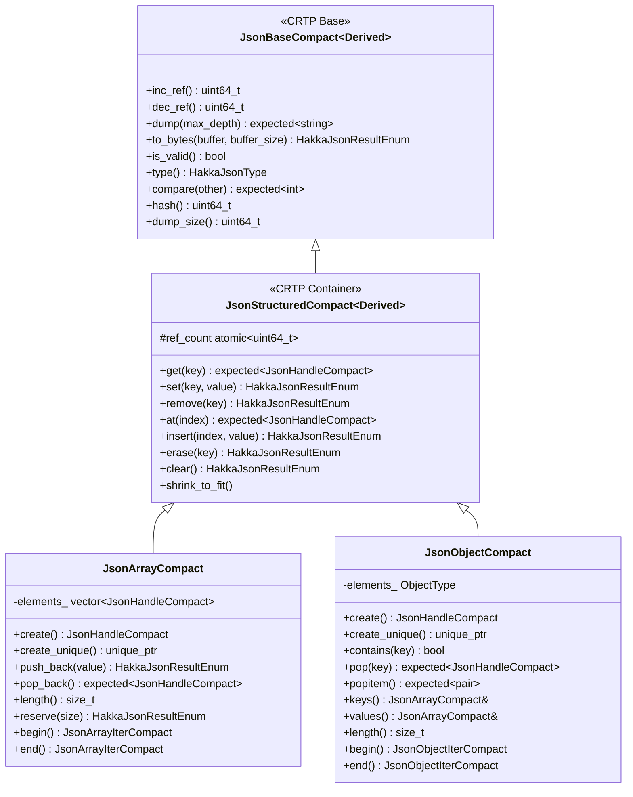

# Structured Types

## Overview

All structured types in Hakka JSON are **mutable containers**. Unlike primitive types which are immutable with value deduplication, structured types can be modified after creation and each instance maintains its own storage.

Structured types are the container nodes in JSON documents. They include:

- **[JsonArray](Array.md)**: Ordered sequences of JSON values with dynamic sizing
- **[JsonObject](Object.md)**: Key-value mappings with insertion order preservation

## Type System Architecture

### CRTP-Based Implementation

All structured types inherit from `JsonStructuredCompact<Derived>`, which uses the Curiously Recurring Template Pattern (CRTP). This eliminates virtual function overhead and enables compile-time polymorphism.

**Inheritance Hierarchy**:



### Common Interface

`JsonStructuredCompact` provides a unified interface for container operations:

```cpp
template <typename Derived>
class JsonStructuredCompact : public JsonBaseCompact<Derived>
{
public:
    // Element access and modification
    tl::expected<JsonHandleCompact, HakkaJsonResultEnum> get(KeyType key) const;
    HakkaJsonResultEnum set(KeyType key, JsonHandleCompact value);
    HakkaJsonResultEnum remove(KeyType key);
    tl::expected<JsonHandleCompact, HakkaJsonResultEnum> at(uint32_t index) const;

    // Container modification
    HakkaJsonResultEnum insert(KeyType index, JsonHandleCompact value);
    HakkaJsonResultEnum erase(KeyType key);
    HakkaJsonResultEnum clear();
    void shrink_to_fit();

    // Validation
    bool is_valid() const;

protected:
    mutable std::atomic<uint64_t> ref_count = 1;
};
```

**Method Delegation**: All public methods delegate to derived class implementations via static downcasting:
```cpp
get(key) → static_cast<Derived*>(this)->get_impl(key)
```

This CRTP pattern provides zero-cost abstraction—the compiler resolves all calls at compile time with no runtime overhead.

### KeyType Abstraction

Structured types use `KeyType` (a `std::variant<std::string, int64_t>`) to support both:

- **String keys**: For object key-value access (`"key"`)
- **Integer indices**: For array positional access (`0, 1, 2`)

This unified interface allows polymorphic container operations while maintaining type safety.

## Mutability and Storage Independence

### No Value Deduplication

Unlike primitive types, structured types **do not** share storage for identical values:

```cpp
auto array1 = JsonArrayCompact::create();
auto array2 = JsonArrayCompact::create();

auto* arr1 = std::get<JsonArrayCompact*>(array1.get_mut_ptr());
auto* arr2 = std::get<JsonArrayCompact*>(array2.get_mut_ptr());

arr1->push_back(JsonIntCompact::create(42));
arr2->push_back(JsonIntCompact::create(42));

// array1 and array2 are distinct instances with separate storage
// Modifying array1 does NOT affect array2
```

**Rationale**: Mutable containers cannot safely share storage because modifications to one instance would affect all instances sharing that storage.

### Storage Ownership

Each structured type instance owns its storage:

- **JsonArrayCompact**: Owns a `std::vector<JsonHandleCompact>` for element storage
- **JsonObjectCompact**: Owns two `JsonArrayCompact` handles (one for keys, one for values)

**Design Note**: The base class `JsonStructuredCompact` does **not** define storage members. Derived classes define their own storage to accommodate different structural requirements (arrays need one vector, objects need two parallel arrays).

## Memory Management

### Reference Counting

All structured types use atomic reference counting for lifetime management:

```cpp
mutable std::atomic<uint64_t> ref_count = 1;

uint64_t inc_ref() const {
    return ref_count.fetch_add(1, std::memory_order_relaxed) + 1;
}

uint64_t dec_ref() const {
    return ref_count.fetch_sub(1, std::memory_order_relaxed) - 1;
}
```

**Memory Ordering**: Uses `memory_order_relaxed` because reference counting operations do not require inter-thread synchronization. The manager's mutex provides synchronization for object access.

**Lifetime**: Objects are destroyed when their reference count reaches zero.

**Python FFI Integration**: Reference counting is designed for seamless integration with Python's reference counting system, enabling efficient Python bindings.

### Manager-Based Allocation

Structured types are managed by type-specific managers:

- **ArrayManagerCompact**: Manages all `JsonArrayCompact` instances (type mask `0x80000000`)
- **ObjectManagerCompact**: Manages all `JsonObjectCompact` instances (type mask `0xC0000000`)

**Manager Responsibilities**:

- Allocate and deallocate instances
- Track active instances in a handle vector
- Maintain a freelist (min-heap) for index reuse
- Provide thread-safe handle operations via `std::recursive_mutex`

## Handle System Integration

Structured types are accessed through `JsonHandleCompact`, a 32-bit handle that encodes both type information and object index. See [Handle System](Handle.md) for details.

**Token Encoding for Structured Types**:
```
Bits 31-30: Type category
    10 = Array  (0x80000000)
    11 = Object (0xC0000000)
Bits 29-0: Index into manager's handles vector
```

**Handle Access Performance**: O(1) constant time via direct array indexing:
```cpp
handles_[token & 0x3FFFFFFF]  // Mask extracts 30-bit index
```

## Thread Safety

All structured type operations have specific thread-safety guarantees:

- **Reference counting**: Uses atomic operations (thread-safe)
- **Object creation**: Manager mutex protects handle allocation (thread-safe)
- **Object access**: Manager mutex protects pointer retrieval (thread-safe)
- **Concurrent reads**: Multiple threads can safely read the same container simultaneously
- **Concurrent modifications**: **NOT thread-safe**—external synchronization required

!!! warning "Mutable Access Requires Synchronization"
    Modifying a structured type (via `set()`, `push_back()`, `remove()`, etc.) while other threads are reading or writing requires external synchronization (e.g., `std::mutex`, `std::shared_mutex`).

**Recommendation**: Use `std::shared_mutex` for reader-writer scenarios:
- Multiple concurrent readers: `std::shared_lock`
- Exclusive writer: `std::unique_lock`

## Comparison with Primitives

| Feature | Primitive Types | Structured Types |
|---------|----------------|------------------|
| **Mutability** | Immutable (values never change) | Mutable (containers can be modified) |
| **Deduplication** | Yes (identical values share storage) | No (each instance has separate storage) |
| **Storage** | Managed by primitive managers | Managed by array/object managers |
| **Use Case** | Leaf nodes (scalars) | Container nodes (collections) |
| **Creation Cost** | O(n) lookup for deduplication | O(1) allocation (no deduplication check) |
| **Memory Overhead** | Shared storage reduces memory | Higher memory (no sharing) |
| **Thread Safety** | Immutable = inherently thread-safe reads | Concurrent modifications require synchronization |

## Inheritance Benefits

### From JsonBaseCompact

All structured types inherit common operations:

- **Serialization**: `dump()`, `to_bytes()`, `dump_size()`
- **Type System**: `type()`, `is_valid()`
- **Comparison**: `compare()`, `hash()`
- **Reference Counting**: `inc_ref()`, `dec_ref()`
- **C API Support**: `*_capi()` methods for FFI integration

### From JsonStructuredCompact

Container-specific operations:

- **Access**: `get()`, `at()` for element retrieval
- **Modification**: `set()`, `insert()` for element updates
- **Removal**: `remove()`, `erase()`, `clear()` for element deletion
- **Optimization**: `shrink_to_fit()` for memory reduction

### Derived Class Responsibilities

Concrete structured types must implement:

```cpp
// Required implementations (suffixed with _impl)
tl::expected<JsonHandleCompact, HakkaJsonResultEnum> get_impl(KeyType key) const;
HakkaJsonResultEnum set_impl(KeyType key, JsonHandleCompact value);
HakkaJsonResultEnum remove_impl(KeyType key);
tl::expected<JsonHandleCompact, HakkaJsonResultEnum> at_impl(uint32_t index) const;
HakkaJsonResultEnum insert_impl(KeyType key, JsonHandleCompact value);
HakkaJsonResultEnum erase_impl(KeyType key);
HakkaJsonResultEnum clear_impl();
void shrink_to_fit_impl();

// From JsonBaseCompact
uint64_t inc_ref_impl() const;
uint64_t dec_ref_impl() const;
tl::expected<std::string, HakkaJsonResultEnum> dump_impl(uint32_t max_depth) const;
HakkaJsonResultEnum to_bytes_impl(char *buffer, uint32_t *buffer_size) const;
uint64_t dump_size_impl() const;
bool is_valid_impl() const;
HakkaJsonType type_impl() const;
tl::expected<int, HakkaJsonResultEnum> compare_impl(const JsonHandleCompact &other) const;
uint64_t hash_impl() const;
```

## Performance Characteristics

### CRTP Overhead

**Zero-cost abstraction**: All method calls are resolved at compile time. The compiler inlines calls to `*_impl()` methods, resulting in performance identical to direct method calls.

**No vtable lookup**: Unlike runtime polymorphism (virtual functions), CRTP uses compile-time polymorphism with no function pointer indirection.

### Memory Layout

**Per-instance overhead** (common to all structured types):

- Reference count: 8 bytes (`std::atomic<uint64_t>`)
- Handle manager entry: ~8 bytes (pointer in vector)
- **Base overhead**: ~16 bytes per instance

**Type-specific storage**:

- **Array**: + `std::vector<JsonHandleCompact>` (24 bytes + 4 bytes per element)
- **Object**: + 2 `JsonHandleCompact` handles (8 bytes) + underlying array storage

## Design Rationale

### Why CRTP Instead of Virtual Functions?

**Performance**: Zero overhead compared to vtable-based polymorphism

- No vtable pointer per object (saves 8 bytes)
- No vtable lookup per call (~1-2 CPU cycles saved)
- Enables aggressive inlining and optimization

**Type Safety**: Compile-time type checking prevents runtime errors

**Memory Efficiency**: Critical for large collections (every byte counts when scaling to millions of objects)

### Why Mutable Containers?

**JSON Semantics**: JSON arrays and objects are inherently mutable collections that grow, shrink, and change during program execution.

**Python Compatibility**: Matches Python's mutable list and dict behavior for seamless FFI integration.

**Practical Use Cases**: Most JSON manipulation involves modifying containers (adding fields, updating values, removing elements).

## Type-Specific Documentation

For detailed API documentation and usage patterns, see:

- **[JsonArray](Array.md)** - Dynamic arrays with Python list-like operations
- **[JsonObject](Object.md)** - Key-value mappings with Python dict-like operations

## See Also

- [Primitive Types Overview](Primitive.md) - Immutable scalar types with value deduplication
- [Handle System](Handle.md) - Handle-based memory management
- [Data Types Overview](DataTypesOverview.md) - Complete type system overview
