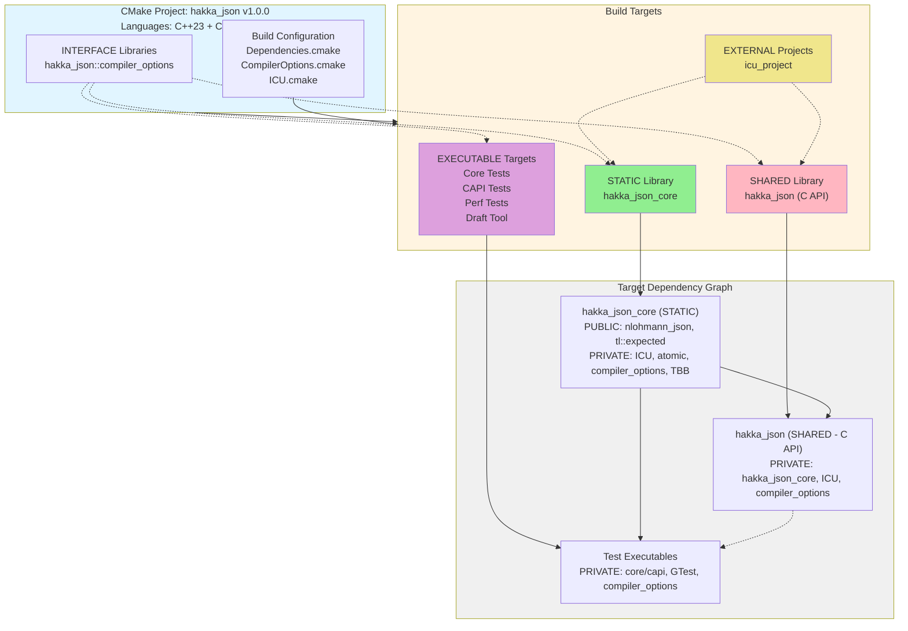

# Build System Architecture

## Overview

The Hakka JSON build system uses CMake 3.20+ with a modular architecture designed for cross-platform compatibility (Linux, macOS, Windows). The system supports both static and shared library builds, optional features, and comprehensive testing infrastructure.

**Distribution Methods**:

- **Conan Package Manager**: Pre-built binaries with dependency management (recommended)
- **Source Build**: Direct CMake builds for development and customization

**Core Philosophy**:

- Explicit source lists (no globbing for reliability)
- Optional system dependencies with automatic fallback
- Platform-specific optimizations
- Strict compiler warnings with sanitizers in debug mode

---

## Package Distribution Architecture

### Conan Package Structure

**Package Metadata**:
```yaml
Name:           hakka_json
Version:        1.0.0
License:        BSL-1.0 OR BSD-3-Clause
Package Type:   library (static by default)
Settings:       os, compiler, build_type, arch
Options:        shared=[True, False], fPIC=[True, False]
```

**Dependency Graph**:
```
hakka_json/1.0.0
├── nlohmann_json/3.11.3 (PUBLIC, header-only)
├── tl-expected/1.1.0 (PUBLIC, header-only)
└── ICU (PRIVATE, statically bundled)
    ├── libicudata.a  (32MB Unicode data)
    ├── libicui18n.a  (17MB internationalization)
    ├── libicuuc.a    (6.4MB common utilities)
    ├── libicuio.a    (113KB I/O streams)
    └── libicutu.a    (820KB tools utilities)
```

**Package Contents**:
```
package/
├── include/              (22 public headers)
│   ├── hakka_json_*.hpp
│   ├── handles/*.hpp
│   └── hakka_json_enum.h
├── lib/                  (libraries)
│   ├── libhakka_json_core.a      (1.4MB - core C++ library)
│   ├── libhakka_json.so          (37MB - C API shared library)
│   ├── libicudata.a              (32MB - bundled ICU)
│   ├── libicui18n.a              (17MB - bundled ICU)
│   ├── libicuuc.a                (6.4MB - bundled ICU)
│   ├── libicuio.a                (113KB - bundled ICU)
│   └── libicutu.a                (820KB - bundled ICU)
└── licenses/             (license files)
    ├── LICENSE
    ├── LICENSE-BSD
    └── LICENSE-BOOST
```

**Critical Design Decision - ICU Static Linking**:

- ICU is **statically bundled** within the Conan package
- All ICU libraries (~56MB total) are included in the package
- Consumers automatically link against bundled ICU libraries
- No external ICU dependency required on consumer systems
- Ensures consistent Unicode behavior across platforms

**Package Info (CMake Integration)**:
```cmake
# Conan generates these targets:
HakkaJson::core

# Link order (automatic via Conan):
hakka_json_core → icutu → icui18n → icuio → icuuc → icudata

# System libraries (32-bit platforms):
atomic (GCC/Clang on x86, armv7)
```

**Compiler Requirements**:
```yaml
Minimum Versions:
  GCC:         11
  Clang:       15
  AppleClang:  14
  MSVC:        193 (Visual Studio 2022 17.3)

C++ Standard:  C++23 (required, no fallback)
```

---

## Architectural View

### CMake Target Architecture



### Build Targets

#### **Primary Targets**

| Target Name | Type | Output | Purpose |
|-------------|------|--------|---------|
| `hakka_json_core` | STATIC | `libhakka_json_core.{a,lib}` | Core C++ library |
| `hakka_json` | SHARED | `libhakka_json.{so,dll,dylib}` | C API wrapper |
| `hakka_json::compiler_options` | INTERFACE | (none) | Compiler configuration |

#### **External Project Targets**

| Target Name | Type | Purpose |
|-------------|------|---------|
| `icu_project` | ExternalProject | Build ICU from source |
| `icu_project_libs` | CUSTOM | Dependency aggregator for ICU libraries |
| `icu{i18n,uc,data,io,tu}` | IMPORTED STATIC | ICU library components (Unix) |
| `icu{in,uc,dt,io,tu}` | IMPORTED STATIC | ICU library components (Windows) |

#### **Test Targets**

**Core Tests** (8 executables):
```
t_array, t_bool, t_float, t_int, t_invalid, t_null, t_object, t_string
```

**C API Tests** (4 executables):
```
capi_array, capi_object, capi_primitive, capi_complex
```

**Performance Tests**:
```
handle_perf_benchmark
```

**Utility Targets**:
```
draft (test/development executable)
```

---

### Component Architecture

#### **Static Library Component** (`hakka_json_core`)

**CMake Properties**:
```cmake
TYPE:                    STATIC_LIBRARY
POSITION_INDEPENDENT_CODE: ON
LANGUAGE:                CXX (C++23)
NAMESPACE:               hakka_json::core
```

**Link Interface**:
```cmake
PUBLIC DEPENDENCIES:
  - nlohmann_json::nlohmann_json  (INTERFACE, header-only)
  - tl::expected                  (INTERFACE, header-only)

PRIVATE DEPENDENCIES:
  - ICU libraries (5 components, IMPORTED STATIC)
  - atomic (GCC only, system library)
  - TBB::tbb (optional, system library)
  - hakka_json::compiler_options (INTERFACE)
```

**Include Directories**:
```cmake
PUBLIC (consumers inherit):
  $<BUILD_INTERFACE:${PROJECT_SOURCE_DIR}>
  $<BUILD_INTERFACE:${PROJECT_SOURCE_DIR}/include>
  $<INSTALL_INTERFACE:include>

PRIVATE (internal only):
  ${CMAKE_CURRENT_SOURCE_DIR}
```

**Output Location**: `${CMAKE_BINARY_DIR}/src/` -> `${PROJECT_SOURCE_DIR}/target/release/`

---

#### **Shared Library Component** (`hakka_json`)

**CMake Properties**:
```cmake
TYPE:                    SHARED_LIBRARY
POSITION_INDEPENDENT_CODE: ON
LANGUAGE:                CXX (C++23)
NAMESPACE:               hakka_json::capi
EXPORT_NAME:             hakka_json (no namespace for C API)
```

**Link Interface**:
```cmake
PRIVATE DEPENDENCIES:
  - hakka_json::core (STATIC, brings transitive deps)
  - ICU libraries (re-linked for shared lib symbols)
  - hakka_json::compiler_options (INTERFACE)

PUBLIC DEPENDENCIES:
  (none - pure C interface)
```

**Symbol Visibility**:
```cmake
Windows: DLL exports via __declspec(dllexport)
Unix:    Default visibility (all symbols exported)
```

**Output Location**: `${CMAKE_BINARY_DIR}/capi/` -> `${PROJECT_SOURCE_DIR}/target/release/`

---

#### **Interface Library Component** (`hakka_json::compiler_options`)

**CMake Properties**:
```cmake
TYPE:                    INTERFACE_LIBRARY
LANGUAGE:                (none - configuration only)
NAMESPACE:               hakka_json::compiler_options
```

**Compile Options** (generator expressions):
```cmake
Warnings:
  $<$<OR:$<CXX_COMPILER_ID:GNU>,$<CXX_COMPILER_ID:Clang>>:-Wall -Wextra -Wpedantic -Werror>
  $<$<CXX_COMPILER_ID:MSVC>:/W4 /WX>

Debug Sanitizers:
  $<$<AND:$<CONFIG:Debug>,$<CXX_COMPILER_ID:GNU>>:-fsanitize=address,undefined,leak>
  $<$<AND:$<CONFIG:Debug>,$<CXX_COMPILER_ID:Clang>>:-fsanitize=address,undefined,leak>

Release Optimization:
  $<$<AND:$<CONFIG:Release>,$<OR:$<CXX_COMPILER_ID:GNU>,$<CXX_COMPILER_ID:Clang>>>:-O3>
  $<$<AND:$<CONFIG:Release>,$<CXX_COMPILER_ID:MSVC>>:/O2>
```

**Compile Definitions**:
```cmake
$<$<CXX_COMPILER_ID:MSVC>:_CRT_SECURE_NO_WARNINGS _CTYPE_DISABLE_MACROS>
$<$<CONFIG:Release>:NDEBUG>
```

---

### External Dependencies

#### **Header-Only Dependencies** (INTERFACE targets)

**nlohmann_json** (>=3.11.3):
```cmake
TARGET TYPE:       INTERFACE (header-only)
ACQUISITION:       find_package() -> FetchContent
REPOSITORY:        https://github.com/nlohmann/json.git
TAG:               v3.11.3
LINK SCOPE:        PUBLIC (exposed in hakka_json_core API)
USAGE:             #include <nlohmann/json.hpp>
```

**tl::expected** (>=1.1.0):
```cmake
TARGET TYPE:       INTERFACE (header-only)
ACQUISITION:       find_package() -> FetchContent
REPOSITORY:        https://github.com/TartanLlama/expected.git
TAG:               v1.1.0
LINK SCOPE:        PUBLIC (return types in hakka_json_core API)
USAGE:             tl::expected<T, E>
```

#### **Compiled Dependencies** (STATIC/SHARED targets)

**ICU** (International Components for Unicode):
```cmake
TARGET TYPE:       IMPORTED STATIC (5 components)
ACQUISITION:       ICU_ROOT -> ExternalProject_Add (auto-build)
BUILD METHOD:      runConfigureICU (Unix) | MSBuild (Windows)
LINK SCOPE:        PRIVATE (never exposed in public API)
CONFIGURATION:     --enable-static --disable-renaming --with-data-packaging=static

UNIX TARGETS:
  - icui18n (internationalization)
  - icuuc   (common utilities)
  - icudata (Unicode data)
  - icuio   (I/O streams)
  - icutu   (tools utilities)

WINDOWS TARGETS:
  - icuin   (internationalization)
  - icuuc   (common utilities)
  - icudt   (Unicode data)
  - icuio   (I/O streams)
  - icutu   (tools utilities)

IMPORTED LOCATIONS:
  Unix:    ${ICU_LIB_DIR}/libicu{i18n,uc,data,io,tu}.{a,so}
  Windows: ${ICU_LIB_DIR}/icu{in,uc,dt,io,tu}.{lib,dll}
```

**GoogleTest** (>=1.15.2):
```cmake
TARGET TYPE:       STATIC/SHARED (configuration-dependent)
ACQUISITION:       find_package() -> FetchContent
REPOSITORY:        https://github.com/google/googletest.git
TAG:               v1.15.2
LINK SCOPE:        PRIVATE (test executables only)
CONFIGURATION:     gtest_force_shared_crt=ON
TARGETS:           GTest::gtest_main, GTest::gmock_main
```

**TBB** (Threading Building Blocks) - Optional:
```cmake
TARGET TYPE:       SHARED (system package)
ACQUISITION:       find_package(TBB REQUIRED)
ACTIVATION:        -DHAKKA_JSON_ENABLE_TBB=ON
LINK SCOPE:        PRIVATE (core library only)
PLATFORM:          x86_64 GCC only
DEFINES:           _ENABLE_STD_EXECUTION_POLICY
```

**atomic** (GCC runtime):
```cmake
TARGET TYPE:       SYSTEM (implicit link)
PLATFORM:          GCC on all platforms
LINK SCOPE:        PRIVATE (core library only)
REASON:            64-bit atomic operations on 32-bit platforms
```

---

### Test Target Architecture

#### **Core Library Tests**

**Target Pattern**: `t_<component>`

| Target | Type | Dependencies | Test Scope |
|--------|------|--------------|------------|
| `t_array` | EXECUTABLE | core + gtest_main | Array container |
| `t_bool` | EXECUTABLE | core + gtest_main | Boolean primitive |
| `t_float` | EXECUTABLE | core + gtest_main | Float primitive |
| `t_int` | EXECUTABLE | core + gtest_main | Integer primitive |
| `t_invalid` | EXECUTABLE | core + gtest_main | Invalid type |
| `t_null` | EXECUTABLE | core + gtest_main | Null primitive |
| `t_object` | EXECUTABLE | core + gtest_main | Object container |
| `t_string` | EXECUTABLE | core + gtest_main | String primitive |

**Link Interface** (all test targets):
```cmake
PRIVATE DEPENDENCIES:
  - hakka_json::core
  - hakka_json::compiler_options
  - GTest::gtest_main
  - GTest::gmock_main
```

**Test Discovery**: `gtest_discover_tests()` integration with CTest

#### **C API Tests**

**Target Pattern**: `capi_<component>`

| Target | Type | Dependencies | Test Scope |
|--------|------|--------------|------------|
| `capi_array` | EXECUTABLE | capi + gtest_main | C API arrays |
| `capi_object` | EXECUTABLE | capi + gtest_main | C API objects |
| `capi_primitive` | EXECUTABLE | capi + gtest_main | C API primitives |
| `capi_complex` | EXECUTABLE | capi + gtest_main | Complex nested structures |

**Link Interface** (all CAPI test targets):
```cmake
PRIVATE DEPENDENCIES:
  - hakka_json::capi
  - hakka_json::compiler_options
  - GTest::gtest_main
  - GTest::gmock_main

INCLUDE DIRECTORIES (additional):
  - ${PROJECT_SOURCE_DIR}/capi (internal headers)
```

#### **Performance Benchmarks**

**Target**: `handle_perf_benchmark`

```cmake
TYPE:           EXECUTABLE
DEPENDENCIES:   hakka_json::core, compiler_options
COMPILE_OPTIONS:
  Unix:   -O2 -march=native
  MSVC:   /O2
INSTALL:        ${CMAKE_INSTALL_PREFIX}/bin/perf/
```

**Custom Targets**:
```cmake
run_perf_benchmark:
  COMMAND: ${CMAKE_CURRENT_BINARY_DIR}/handle_perf_benchmark
  DEPENDS: handle_perf_benchmark

run_perf_stat (Linux only):
  COMMAND: bash run_perf_analysis.sh <benchmark> <output>
  DEPENDS: handle_perf_benchmark
  TOOL:    perf stat (performance counters)
```

---

## Dependency Resolution Strategy

### **Two-Phase Lookup**

```cmake
1. System Package Discovery (if HAKKA_JSON_USE_SYSTEM_DEPS=ON)
   |
   v
   find_package(nlohmann_json 3.11 QUIET)
   |
   v
2. FetchContent Fallback (if not found)
   |
   v
   FetchContent_Declare(nlohmann_json
     GIT_REPOSITORY https://github.com/nlohmann/json.git
     GIT_TAG v3.11.3
   )
   FetchContent_MakeAvailable(nlohmann_json)
```

**Rationale**:

- **System preference**: Respects distro packaging, reduces build time
- **Automatic fallback**: Ensures builds succeed without manual intervention
- **Version pinning**: FetchContent uses exact tags for reproducibility

### **ICU Special Handling**

**Function Wrapper** (for PARENT_SCOPE export):
```cmake
function(_setup_icu)
  include(${CMAKE_SOURCE_DIR}/cmake/ICU.cmake)
  set(ICU_INCLUDE_DIR ${ICU_INCLUDE_DIR} PARENT_SCOPE)
  set(ICU_LIB_DIR ${ICU_LIB_DIR} PARENT_SCOPE)
  # ... export all variables
endfunction()
_setup_icu()
```

**Build Logic**:

1. Check `ICU_ROOT` for pre-installed ICU
2. If not found, determine version:
   - Use `ICU_VERSION` if specified
   - Else fetch latest from GitHub API
3. Download source tarball
4. Build via `ExternalProject_Add`:
   - Unix: Configure -> Make -> Install
   - Windows: MSBuild solution
5. Create IMPORTED targets with BUILD_BYPRODUCTS

**Version Auto-Detection**:
```cmake
file(DOWNLOAD "https://api.github.com/repos/unicode-org/icu/releases/latest" ...)
string(REGEX MATCH "\"tag_name\": \"([^\"]+)\"" ...)
# Converts: "release-76-1" -> ICU_VERSION="76.1"
```

---

## Build Flags & Configuration

### **CMake Options**

| Option | Type | Default | Purpose |
|--------|------|---------|---------|
| `HAKKA_JSON_BUILD_TESTS` | BOOL | OFF | Enable test suites |
| `HAKKA_JSON_USE_SYSTEM_DEPS` | BOOL | ON | Prefer system packages |
| `HAKKA_JSON_ENABLE_PROFILING` | BOOL | OFF | Add `-pg` for gprof |
| `HAKKA_JSON_ENABLE_TBB` | BOOL | OFF | Enable parallel STL |
| `ICU_VERSION` | STRING | Auto | Specific ICU version |
| `ICU_ROOT` | PATH | "" | Pre-installed ICU path |
| `ICU_MSBUILD_PATH` | PATH | Auto | MSBuild.exe location |
| `ICU_ARCH` | STRING | x64 | Windows architecture |

### **Build Configurations**

| Configuration | Purpose | Characteristics |
|---------------|---------|-----------------|
| **Debug** | Development, testing | Sanitizers (Unix), debug symbols, assertions enabled |
| **Release** | Production deployment | Maximum optimization (-O3/O2), assertions disabled |
| **RelWithDebInfo** | Profiling, debugging production | Optimization + debug symbols |
| **MinSizeRel** | Embedded systems | Size optimization (-Os/O1) |

**Platform Variations**:

- **Unix (GCC/Clang)**: Address/UB/Leak sanitizers in Debug, -O3 in Release
- **macOS (AppleClang)**: No sanitizers (compatibility), -O3 in Release
- **Windows (MSVC)**: Debug runtime (/MDd), /O2 in Release

---

## Platform Architecture

### **Binary Format Variations**

| Platform | Static Library | Shared Library | Executable |
|----------|----------------|----------------|------------|
| **Linux** | `.a` | `.so` | (no extension) |
| **macOS** | `.a` | `.dylib` | (no extension) |
| **Windows** | `.lib` | `.dll` + `.lib` (import) | `.exe` |

### **Platform-Specific Build Components**

**Linux**:

- Full sanitizer support
- Alternative linkers (mold, gold, lld)
- ICU: autoconf-based build
- Explicit atomic library linking (GCC)

**macOS**:

- Limited sanitizer support (AppleClang compatibility)
- ICU: autoconf-based build
- Framework-style dylib naming

**Windows**:
- MSVC toolchain primary, clang-cl secondary
- ICU: MSBuild-based build
- CRT consistency requirements (gtest)
- DLL export/import mechanics

---

## Build Artifact Topology

### **Installation Structure**

```
install/
├── include/          (Public API headers)
├── lib/              (Static + shared libraries)
├── bin/              (Executables, Windows DLLs)
└── share/licenses/   (License files)
```

### **Target Output Locations**

| Target | Build Output | Install Location |
|--------|--------------|------------------|
| `hakka_json_core` | `build/src/` | `lib/` |
| `hakka_json` | `build/capi/` | `lib/` (Unix), `bin/` (Windows DLLs) |
| Test executables | `build/tests/{core,capi}/` | Not installed |
| Benchmarks | `build/tests/perf/` | `bin/perf/` |
| ICU libraries | `build/icu-install/lib/` | Private (embedded) |

**Post-Build Copy**: All libraries copied to `target/release/` for convenience

---

## Architectural Design Rationale

### **Target Type Selection**

**Static Core Library**:

- Enables link-time optimization across translation units
- Allows consumers to choose static or shared linking
- Prevents ABI fragmentation issues
- Simplifies symbol visibility management

**Shared C API Library**:

- Required for FFI (foreign function interface) compatibility
- Enables hot-swapping in language bindings
- Explicit C ABI boundary prevents C++ mangling issues
- Facilitates versioning and dynamic updates

**Interface Compiler Options**:

- Zero runtime overhead (header-only configuration)
- Consistent flags across all targets
- Platform-specific handling via generator expressions
- Single source of truth for build configuration

### **Dependency Isolation Strategy**

**Public Dependencies** (exposed in API):

- Header-only libraries only (nlohmann_json, tl::expected)
- No binary dependencies in public interface
- Prevents consumer dependency conflicts

**Private Dependencies** (hidden from consumers):

- All compiled libraries (ICU, atomic, TBB)
- Platform-specific runtime requirements
- Allows internal optimization without ABI impact

### **ICU Build Strategy**

**ExternalProject Integration**:

- Automatic download and build on first configuration
- Cached artifacts reused on subsequent builds
- Supports pre-installed ICU via `ICU_ROOT`
- Platform-specific build commands (autoconf vs MSBuild)

**Rationale**:

- ICU unavailable/outdated on many systems
- Complex build requirements across platforms
- Large dependency (>50MB) benefits from caching
- Static linking with embedded data simplifies deployment

---

## Summary

### **Build System Architecture**

```
+---------------------------------------------------------------+
|                    Build System Layers                        |
+---------------------------------------------------------------+
| Configuration Layer:                                          |
|   - CMake options (HAKKA_JSON_*)                              |
|   - Build configurations (Debug/Release/...)                  |
|   - Platform detection and toolchain setup                    |
+---------------------------------------------------------------+
| Dependency Layer:                                             |
|   - Header-only: nlohmann_json, tl::expected (PUBLIC)         |
|   - Compiled: ICU, atomic, TBB (PRIVATE)                      |
|   - Testing: GoogleTest (PRIVATE, conditional)                |
+---------------------------------------------------------------+
| Target Layer:                                                 |
|   - STATIC: hakka_json_core                                   |
|   - SHARED: hakka_json (C API)                                |
|   - INTERFACE: compiler_options                               |
|   - EXECUTABLE: tests, benchmarks                             |
+---------------------------------------------------------------+
| Output Layer:                                                 |
|   - Build artifacts: .a/.lib, .so/.dll/.dylib                 |
|   - Installation: include/, lib/, bin/, share/                |
+---------------------------------------------------------------+
```

### **Architectural Principles**

**Dependency Management**:

- PUBLIC dependencies are header-only (zero ABI impact)
- PRIVATE dependencies are statically linked (deployment simplicity)
- Two-phase resolution (system packages → auto-download)

**Target Design**:

- Static core enables consumer flexibility
- Shared C API provides stable FFI boundary
- Interface library centralizes configuration

**Platform Strategy**:

- Common CMake logic for all platforms
- Platform-specific variations isolated via generator expressions
- Consistent behavior through compiler options interface

**Build Workflow**:

1. Configure: Detect platform, resolve dependencies
2. Generate: Create build system (Ninja/Make/MSBuild)
3. Build: Compile targets with platform-specific flags
4. Test: Execute test suites (if enabled)
5. Install: Deploy to standard layout

### **Key Design Invariants**

1. **Layered Dependencies**: Core → C API → Tests (acyclic)
2. **ABI Stability**: Only C API exposed for FFI, C++ internal
3. **Build Hermeticity**: Self-contained builds via FetchContent/ExternalProject
4. **Platform Parity**: Identical functionality across Linux/macOS/Windows
5. **Configuration Transparency**: All options explicit, no hidden defaults
